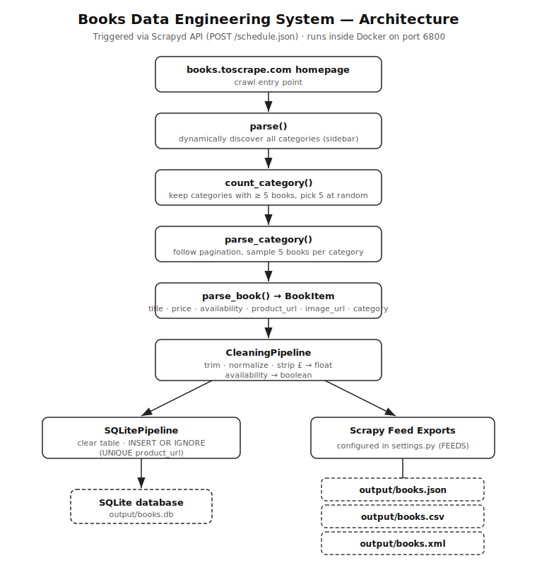

# Enterprise Web Scraping Pipeline – Books Data Engineering System

A production-style [Scrapy](https://scrapy.org/) application that crawls
[books.toscrape.com](https://books.toscrape.com/), samples books across
categories, cleans and validates the data through item pipelines, exports it to
multiple file formats, persists it to SQLite, and ships as a self-deploying
Docker image running [Scrapyd](https://scrapyd.readthedocs.io/).

---

## Table of Contents

- [Project Overview](#project-overview)
- [Features](#features)
- [Tech Stack](#tech-stack)
- [Installation Guide](#installation-guide)
- [Environment Setup](#environment-setup)
- [Running the Spider](#running-the-spider)
- [Docker Setup Guide](#docker-setup-guide)
- [Scrapyd Deployment Guide](#scrapyd-deployment-guide)
- [Output Format Description](#output-format-description)
- [Database Configuration](#database-configuration)
- [Architecture Diagram](#architecture-diagram)
- [Folder Structure](#folder-structure)
- [Design Decisions](#design-decisions)
- [Known Limitations](#known-limitations)

---

## Project Overview

The spider starts from the homepage and **dynamically discovers every book
category** (no hardcoded names or URLs). Because some categories on the target
site contain fewer than five books, the spider first measures each category,
keeps only those with at least five books, then **randomly selects 5 categories**
and **randomly selects 5 books from each** — producing a consistent dataset of
**25 books per run**.

Each selected book is scraped for six fields, passed through a cleaning
pipeline, written to JSON/CSV/XML via Scrapy Feed Exports, and inserted into a
SQLite database. The whole project is containerized so that a single
`docker run` brings up Scrapyd with the project already deployed and ready to be
triggered through the Scrapyd HTTP API.

---

## Features

- **Dynamic category discovery** — categories are read from the homepage
  sidebar at runtime; nothing is hardcoded.
- **Eligibility-aware sampling** — categories with fewer than 5 books are
  excluded so every run yields exactly 25 books.
- **Random selection** — 5 random categories, 5 random books each.
- **Full pagination** — every page of a selected category is followed before
  sampling, so books are drawn from the complete category, not just page one.
- **Item pipelines** — whitespace trimming, text normalization, currency-symbol
  stripping, price-to-float conversion, and availability-to-boolean mapping.
- **Multi-format export** — `books.json`, `books.csv`, `books.xml` via Scrapy
  Feed Exports configured in `settings.py`.
- **SQLite persistence** — records inserted through a dedicated item pipeline;
  the table is reset each run so the database always matches the exported files.
- **Self-deploying Docker image** — Scrapyd starts, the project auto-deploys,
  and the API is exposed on port 6800 with zero manual steps.
- **Logging** — crawl progress, category counts, selection decisions, and
  database lifecycle events are logged.

---

## Tech Stack

| Layer            | Technology                          |
| ---------------- | ----------------------------------- |
| Language         | Python 3.12                         |
| Scraping         | Scrapy 2.16                         |
| Deployment       | Scrapyd 1.6, scrapyd-client 2.0     |
| Database         | SQLite (Python standard library)    |
| Exports          | JSON, CSV, XML (Scrapy Feed Exports)|
| Containerization | Docker (`python:3.12-slim`)         |

All dependencies are pinned in [`requirements.txt`](requirements.txt).

---

## Installation Guide

### Prerequisites

- Python 3.12+
- `git`
- (Optional) Docker, if you want to run the containerized Scrapyd setup

### Clone the repository

```bash
git clone <your-repo-url>
cd books-web-scraper
```

---

## Environment Setup

Create and activate a virtual environment, then install the pinned dependencies.

**Linux / macOS**

```bash
python3 -m venv venv
source venv/bin/activate
pip install --upgrade pip
pip install -r requirements.txt
```

**Windows (PowerShell)**

```powershell
python -m venv venv
venv\Scripts\Activate.ps1
pip install --upgrade pip
pip install -r requirements.txt
```

---

## Running the Spider

The Scrapy project lives in the `books_scraper/` directory (this is where
`scrapy.cfg` is). Run the spider from there:

```bash
cd books_scraper
scrapy crawl books
```

On completion you will find the exports and database under
`books_scraper/output/`:

```
output/books.json
output/books.csv
output/books.xml
output/books.db
```

> The `output/` directory and the `FEEDS` paths are **relative to the directory
> the crawl runs from**. Running from inside `books_scraper/` writes to
> `books_scraper/output/`. (Inside Docker the working directory is `/app`, so
> output lands in `/app/output/` — see below.)

---

## Docker Setup Guide

The image is built from the repository root (the build context needs both
`requirements.txt` at the root and the `books_scraper/` project).

### Build

```bash
docker build -t books-scraper .
```

### Run

```bash
docker run --rm -p 6800:6800 -v "$(pwd)/output:/app/output" --name books books-scraper
```

- `-p 6800:6800` publishes the Scrapyd API to your host.
- `-v "$(pwd)/output:/app/output"` mounts a host folder so the exports and the
  SQLite database survive after the container exits. (On Windows PowerShell use
  `-v "${PWD}/output:/app/output"`; on `cmd.exe` use `-v "%cd%/output:/app/output"`.)

On startup the container:

1. Starts Scrapyd in the background.
2. Polls `daemonstatus.json` until Scrapyd is ready.
3. Deploys the project (`scrapyd-deploy local -p books_scraper`).
4. Keeps Scrapyd in the foreground so the container stays alive.

When you see `Deployment complete` in the logs, Scrapyd is up and the project is
already deployed — **no manual steps required**.

### What the container provides

| File           | Purpose                                                         |
| -------------- | -------------------------------------------------------------- |
| `Dockerfile`   | Builds the image on `python:3.12-slim`, installs deps + curl.  |
| `scrapyd.conf` | Binds Scrapyd to `0.0.0.0:6800`; copied to `/etc/scrapyd/`.    |
| `entrypoint.sh`| Starts Scrapyd, waits for readiness, deploys, stays foreground.|
| `.dockerignore`| Excludes venv, caches, output, DBs, git, and build artifacts.  |

---

## Scrapyd Deployment Guide

### Deploy target

The deploy target is configured in [`books_scraper/scrapy.cfg`](books_scraper/scrapy.cfg):

```ini
[deploy:local]
url = http://localhost:6800/
project = books_scraper
```

### Using the Dockerized Scrapyd (recommended)

Deployment happens automatically when the container starts. Once it is running,
trigger the spider through the API:

```bash
# Schedule a crawl
curl http://localhost:6800/schedule.json -d project=books_scraper -d spider=books
```

Other useful endpoints:

```bash
# Daemon health
curl http://localhost:6800/daemonstatus.json

# List deployed spiders
curl "http://localhost:6800/listspiders.json?project=books_scraper"

# List running / finished jobs
curl "http://localhost:6800/listjobs.json?project=books_scraper"
```

You can also open `http://localhost:6800/` in a browser for the Scrapyd web UI.

### Deploying manually (without Docker)

Start Scrapyd locally, then deploy from the project directory:

```bash
scrapyd                       # in one terminal
cd books_scraper              # in another terminal
scrapyd-deploy local -p books_scraper
```

---

## Output Format Description

Each record contains the six required fields:

| Field          | Type    | Description                                  |
| -------------- | ------- | -------------------------------------------- |
| `title`        | string  | Book title                                   |
| `price`        | float   | Numeric price, currency symbol removed       |
| `availability` | boolean | `true` when in stock, `false` otherwise      |
| `product_url`  | string  | URL of the book's detail page                |
| `image_url`    | string  | URL of the book's cover image                |
| `category`     | string  | Category the book was sampled from           |

**Example (`books.json`):**

```json
[
  {
    "title": "It's Only the Himalayas",
    "price": 45.17,
    "availability": true,
    "product_url": "https://books.toscrape.com/catalogue/its-only-the-himalayas_981/index.html",
    "image_url": "https://books.toscrape.com/media/cache/27/a5/27a53d0bb95bdd88288eaf66c9230d7e.jpg",
    "category": "Travel"
  }
]
```

The same records are written to `books.csv` (one row per book) and `books.xml`
(one `<item>` per book), and inserted into SQLite. All four outputs contain the
same 25 records per run.

---

## Database Configuration

- **Engine:** SQLite (no external service required).
- **Location:** controlled by the `SQLITE_DB_PATH` setting in `settings.py`
  (default `output/books.db`).
- **Schema:**

  ```sql
  CREATE TABLE IF NOT EXISTS books (
      id            INTEGER PRIMARY KEY AUTOINCREMENT,
      title         TEXT,
      price         REAL,
      availability  INTEGER,   -- 1 = in stock, 0 = out of stock
      product_url   TEXT UNIQUE,
      image_url     TEXT,
      category      TEXT
  );
  ```

- **Consistency:** the table is cleared at the start of every crawl
  (`open_spider`), mirroring the `overwrite: True` behavior of the feed exports.
  This guarantees the database row count always equals the exported file count.
- **Insertion:** handled by `SQLitePipeline` (an item pipeline), using
  `INSERT OR IGNORE` against the `UNIQUE(product_url)` constraint as in-run
  de-duplication insurance.

---

## Architecture Diagram



> The image above is a vector file ([`docs/architecture.svg`](docs/architecture.svg))

---

## Folder Structure

```
books-web-scraper/
├── Dockerfile                  # Image definition (python:3.12-slim + Scrapyd)
├── scrapyd.conf                # Scrapyd config (binds 0.0.0.0:6800)
├── entrypoint.sh               # Starts Scrapyd, auto-deploys, stays foreground
├── .dockerignore               # Build-context excludes
├── .gitattributes              # Forces LF endings for *.sh
├── requirements.txt            # Pinned dependencies
├── README.md
└── books_scraper/              # Scrapy project root (contains scrapy.cfg)
    ├── scrapy.cfg              # Scrapy + Scrapyd deploy config
    ├── setup.py                # Packaging for scrapyd-deploy
    └── books_scraper/          # Python package
        ├── __init__.py
        ├── items.py            # BookItem definition
        ├── middlewares.py      # Default Scrapy middlewares
        ├── pipelines.py        # CleaningPipeline + SQLitePipeline
        ├── settings.py         # Settings, FEEDS, ITEM_PIPELINES
        └── spiders/
            ├── __init__.py
            └── books_spider.py # BooksSpider (the crawl logic)
```

---

## Design Decisions

- **Two-phase crawl (count, then sample).** The spider visits each category once
  to read its book count, filters to categories with ≥ 5 books, then re-crawls
  the selected categories with full pagination to sample. This makes "5 books
  per category" achievable for every selected category and keeps the per-run
  total at a deterministic 25. The re-crawl of selected categories uses
  `dont_filter=True` because their index URLs were already fetched while counting.
- **Separation of concerns via pipelines.** `CleaningPipeline` owns all data
  normalization; `SQLitePipeline` owns persistence. The spider only extracts raw
  values. This keeps each component single-responsibility and easy to test.
- **Settings-driven configuration.** Feed exports, the database path, the start
  URL, and pipeline ordering are all configured in `settings.py` rather than
  hardcoded in code.
- **Storage consistency by design.** Clearing the table on `open_spider` keeps
  the database aligned with the overwrite-on-each-run feed exports.
- **Polite crawling.** `ROBOTSTXT_OBEY = True`, `DOWNLOAD_DELAY = 1`, and
  `CONCURRENT_REQUESTS_PER_DOMAIN = 1` are set to avoid hammering the target.
- **Self-contained deployment.** The Docker entrypoint deploys the project to
  Scrapyd automatically so the container is usable immediately after `docker run`.

---

## Known Limitations

- **Single target site.** Selectors are tuned for books.toscrape.com; a
  different site layout would require selector changes.
- **Image URL depends on the carousel markup.** `image_url` is read from the
  active carousel image on the product page; a markup change there would affect
  that field.
- **SQLite only.** The project persists to SQLite; MongoDB is not configured.
  (The assignment allows either; SQLite was chosen for its zero-setup, embedded
  nature.)
- **Non-reproducible sample.** Category and book selection uses `random` with no
  fixed seed, so each run picks a different set of 25 books. Re-running will not
  reproduce the same records.

---
